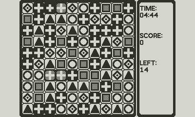

# Znax Playdate
   

Znax is a remake of a game by Nick Kouvaris. It is a sort of puzzle / arcade game where you as the player need to select 4 blocks of the same color as the corners of rectangles as big as you can.

## Controls Playdate / XBox Controller

| Button      | Action                                        |
|-------------|-----------------------------------------------|
| DPAD        | Selections in menus, move Selector            |
| A           | Confirm in menus, slect a block               |
| B           | Back to titlescreen                           |

## Controls Keyboard

| Key         | Action                                        |
|-------------|-----------------------------------------------|
| SPACE, A    | Confirm in menus, select a block               |
| B           | Back to titlescreen                           |
| ARROW KEYS  | Selections in menus, move Selector            |
| ENTER       | System menu                                   |
| F           | Switch Fullscreen / Windowed                  |
| F3          | Select Next Game Assets Sources & Reset       |
| F4          | Quit Game                                     |

## Playing the Game:
You as the player need to select 4 blocks of the same color of the corners of rectangles as big as you can. By doing so you will erase all blocks in this rectangle and they will be replaced by new blocks. You keep on doing this untill the time runs out, and try to gain your highest score possible. 

## Game Modes:
There are two game modes, Relative Timer and Fixed Timer.

### Fixed Timer:
In this mode you don't get extra time for deleting blocks but just points added to your score so here you try to get the highest amount of points in the given time period.

### Relative Timer:
In this mode you will gain extra time for deleting blocks and points added, you try to keep gaining time so you can play longer and gain higher scores. 

## Credits
Game Remake Created by Willems Davy, Original game by Nick Kouvaris. The original flash game is still available on [wayback machine](https://web.archive.org/web/20090220141735/http://lightforce.freestuff.gr/znax.php)

### Music
Music was made by donskeeto for the gp2x game version and resued in this version

### Graphics
All Graphics were made by Willems Davy initially for the gp2x version in jasc paint shop pro 7. The graphics have been adapted for the playdate handheld resolution using gimp.

### Sound
Game Sounds are some parts recorded by Willems Davy and modified with goldwave studio (for the voices), some parts were made using SFXR

## License
License of my part of game's code is MIT